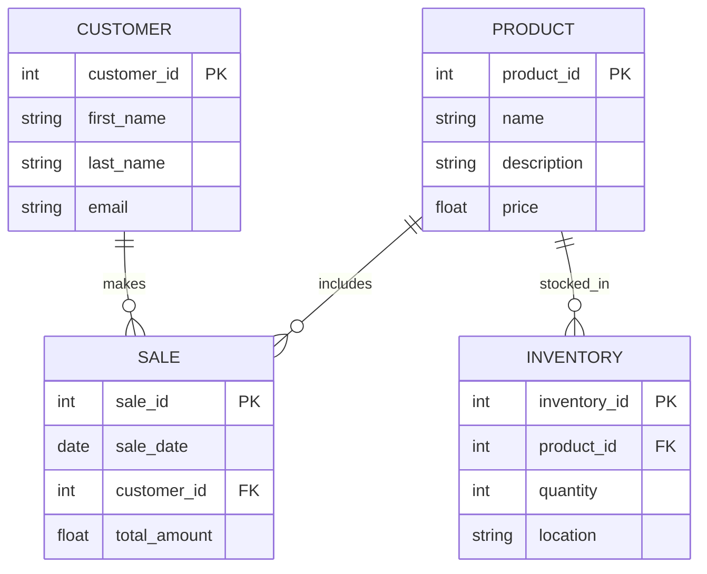

```mermaid
erDiagram
    PRODUCT {
        int product_id PK
        string name
        string description
        float price
    }

    CUSTOMER {
        int customer_id PK
        string first_name
        string last_name
        string email
    }

    SALE {
        int sale_id PK
        date sale_date
        int customer_id FK
        float total_amount
    }

    INVENTORY {
        int inventory_id PK
        int product_id FK
        int quantity
        string location
    }

    PRODUCT ||--o{ SALE : includes
    CUSTOMER ||--o{ SALE : makes
    PRODUCT ||--o{ INVENTORY : stocked_in
```

