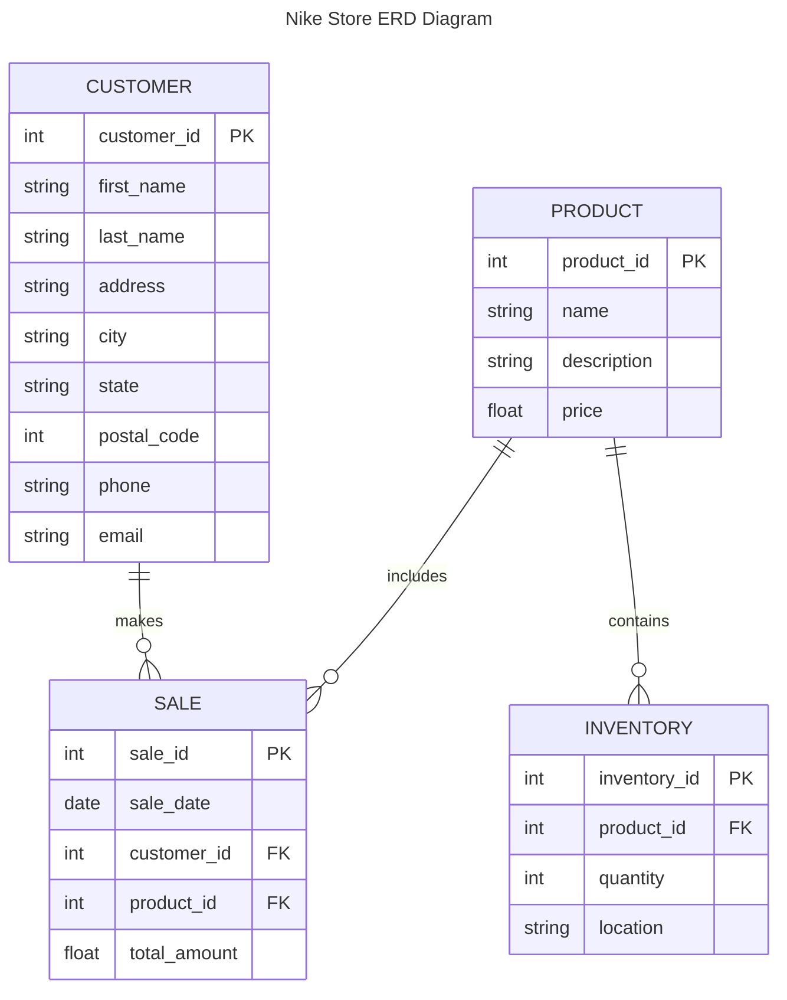

# Documentation

## CUSTOMER table

Represents individuals who purchase products from the store.
customer_id (PK): Unique identifier for each customer.
first_name: Customer's first name.
last_name: Customer's last name.
address: Street address.
city: City of residence.
state: State of residence.
postal_code: ZIP code.
phone: Contact number.
email: Email address.

## PRODUCT table
Details the items available for sale.
product_id (PK): Unique identifier for each product.
name: Product name.
description: Description of the product.
price: Price of the product.

## SALE table
Captures individual sales transactions made by customers.
sale_id (PK): Unique identifier for each sale.
sale_date: Date of the transaction.
customer_id (FK): Links to the CUSTOMER who made the purchase.
product_id (FK): Links to the PRODUCT purchased.
total_amount: Total amount for the sale.

## INVENTORY table
Tracks available items of the store 
inventory_id (PK): Unique identifier for each inventory record.
product_id (FK): Links to the PRODUCT in inventory.
quantity: Number of units available.
location: Warehouse or store location of the inventory.

_Relationships 

1. CUSTOMER makes SALE
One-to-many 
One customer can make many sales, but each sale is made by one specific customer.

2. SALE includes PRODUCT
Many-to-one 
Each sale includes one product, but a product can appear in many sales.

3. PRODUCT contains INVENTORY
One-to-many 
A product can be present in multiple inventory records, but each inventory record corresponds to one specific product.